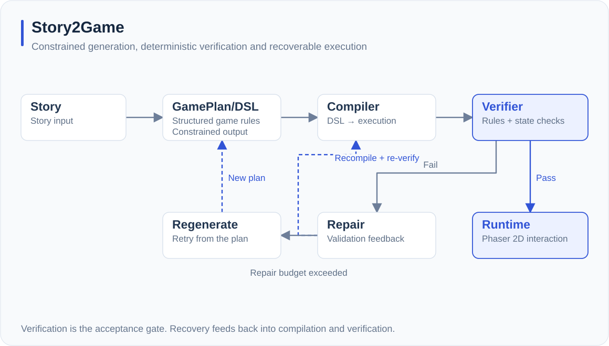
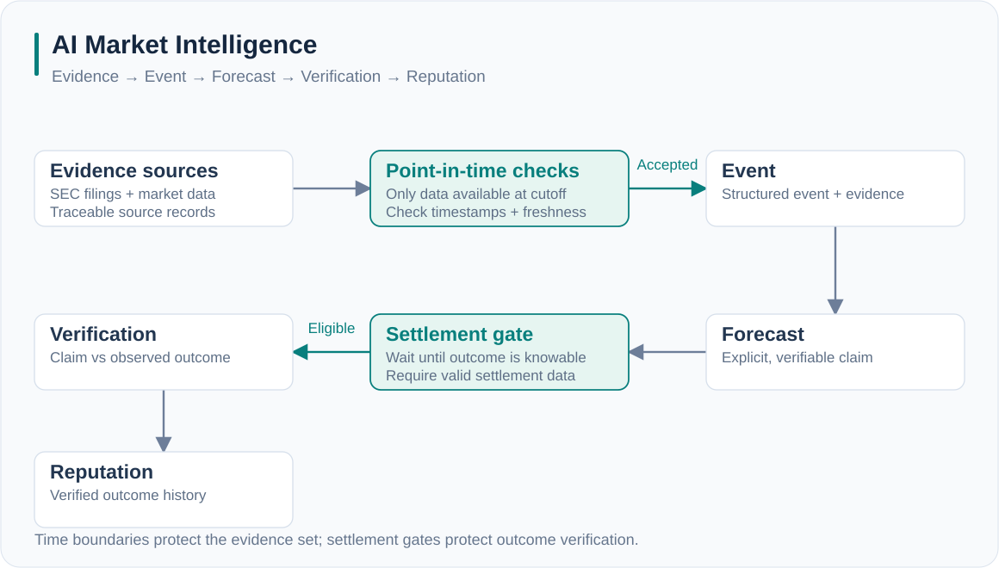
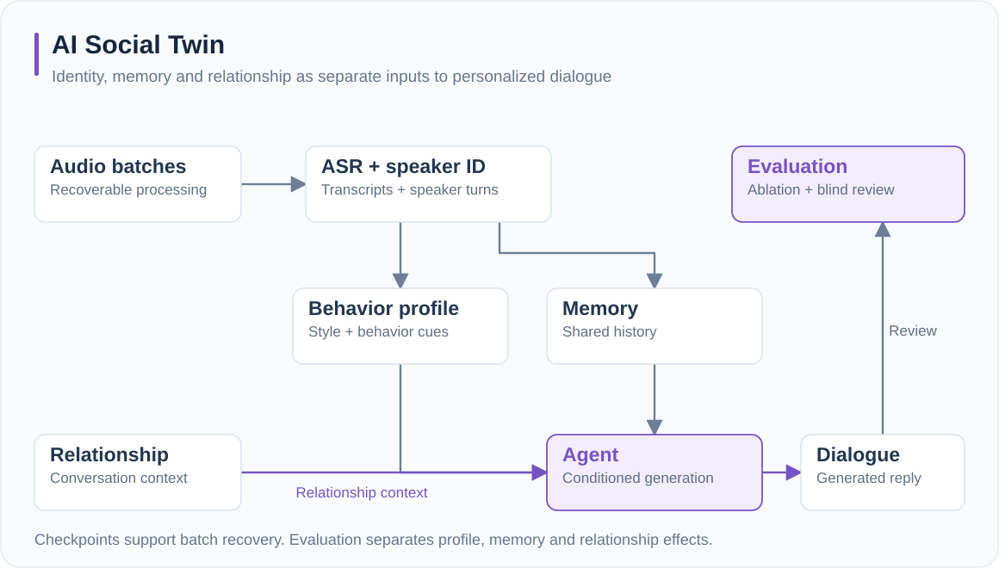
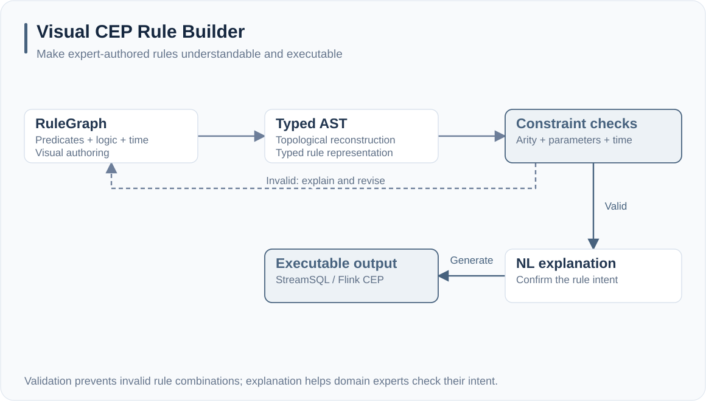

# 李昊 · Hao Li

**AI 应用开发 · Agent Systems · Technical AI Product**

我把模型能力转化为可验证、可恢复的实际系统。

I build LLM applications with verifiable execution, recoverable workflows and useful interfaces.

- 柏林工业大学计算机工程硕士在读，预计 **2026.10** 毕业 / TU Berlin, expected Oct 2026.
- 企业 **RAG、Hybrid Search、Tool Calling、Multi-Agent** 工作流经验。
- 求职方向：**AI 应用开发、Agent 开发、AI 全栈、技术型 AI 产品岗位**。
- 中国为主，德国 / 香港为辅 · Chinese / English / German C1.
- 联系 / Contact: **geemakerlee@gmail.com**

[中英文项目网站 / Portfolio](https://geemakerlee.github.io/GeeMakerLee/) · [English](https://geemakerlee.github.io/GeeMakerLee/?lang=en) · [现有作品集 / Current portfolio](https://hao-li-portfolio.geemakerlee.chatgpt.site/)

## Selected projects / 精选项目

| 项目 | 解决的问题 | 工程重点 |
| --- | --- | --- |
| [**Story2Game**](docs/projects/story2game.md) | 让故事成为可执行的世界 | Agent Pipeline · DSL · Phaser |
| [**AI Market Intelligence**](docs/projects/ai-market.md) | 让 AI 判断有证据、有时间边界 | FastAPI · PostgreSQL · Point-in-Time |
| [**AI Social Twin**](docs/projects/social-twin.md) | 个性化，不止一种说话风格 | Memory · Relationship · Evaluation |
| [**Visual CEP Rule Builder**](docs/projects/rule-builder.md) | 把专业规则交还给领域专家 | React · Typed AST · Flink CEP |

### Story2Game

把自然语言故事转换为结构化游戏，用验证、修复与重新生成闭环处理不可靠的输出。

Turning natural-language stories into structured games through generation, verification and recovery.

**我的贡献 / Contribution：** 设计 GamePlan 与结构化 DSL，连接编译器和确定性运行时；构建 Repair、Regeneration 与 Re-verification；实现 Phaser 2D 交互切片。

[项目详解 / Case study](docs/projects/story2game.md) · [查看全图 / Full-size diagram](docs/assets/diagrams/story2game.svg)

<!-- 真实截图可加入此处；不要创建虚构界面。 -->

### AI Market Intelligence

将信息采集、模型推理与事后验证连接起来，关注证据溯源、时间一致性和结果可复现。

Connecting evidence, model reasoning and outcome verification with traceable sources and temporal integrity.

**我的贡献 / Contribution：** 设计 Evidence → Event → Forecast → Verification → Reputation 链路，接入真实行情与 SEC 数据，实现 PIT、结算门控与回归验证。

[项目详解 / Case study](docs/projects/ai-market.md) · [查看全图 / Full-size diagram](docs/assets/diagrams/ai-market.svg)

<!-- 真实截图可加入此处；不要创建虚构界面。 -->

### AI Social Twin

结合共享记忆与关系条件建模，让同一分身在不同关系中呈现不同的互动方式。

Combining shared memory and relationship-conditioned behavior to personalize interactions.

**我的贡献 / Contribution：** 设计语音处理、说话人识别、行为特征、记忆与生成链路；实现分批处理和 checkpoint 恢复；构建消融与盲评框架。

[项目详解 / Case study](docs/projects/social-twin.md) · [查看全图 / Full-size diagram](docs/assets/diagrams/social-twin.svg)

<!-- 真实截图可加入此处；不要创建虚构界面。 -->

### Visual CEP Rule Builder

用可视化节点表达复杂流式监测规则，再转为类型化 AST、自然语言解释与执行代码。

Visual authoring of streaming rules, translated into a typed AST, explanation and executable code.

**我的贡献 / Contribution：** 设计 RuleGraph 与 AST 映射、拓扑重构和约束验证；实现条件、逻辑和时间节点，以及 StreamSQL / Flink CEP 输出。

[项目详解 / Case study](docs/projects/rule-builder.md) · [查看全图 / Full-size diagram](docs/assets/diagrams/rule-builder.svg)

<!-- 真实截图可加入此处；不要创建虚构界面。 -->

## How I build

**Generate with models. Validate with explicit rules. Recover with clear state.**

关注模型响应之后的工程环节：结构化输出、约束验证、工具执行、状态一致性、评测和失败恢复。

I focus on the part after an LLM response: structured output, constraints, tool execution, state consistency, evaluation and failure recovery.

## Experience / 经历

**AI 应用工程师实习 · 深圳市麦捷微电子科技股份有限公司**  
**AI Application Engineer Intern · Shenzhen Microgate Technology**  
2025.08–Present

企业 RAG 与部门级 Agent：混合检索、Tool Calling、部门知识库隔离；生产自动化中结合任务状态、确定性规则与 LLM 解释。

Enterprise RAG and department-level agents with hybrid retrieval, Tool Calling and isolated knowledge spaces; production automation with task state, deterministic checks and LLM explanations.

**Software Development · TU Berlin DIMA Lab**  
2023.04–2025.06

可视化 CEP 规则构建、RuleGraph 到类型化 AST、拓扑重构、约束验证与执行代码生成。

Visual CEP rule authoring, graph-to-AST mapping, topological reconstruction, validation and executable rule generation.

## Toolkit

**Backend:** Python · SQL · FastAPI · PostgreSQL · Java · C/C++  
**AI:** LLM applications · RAG · Multi-Agent · Tool Calling · Memory · Evaluation  
**Frontend & infrastructure:** TypeScript · React / Next.js · Docker · Linux · Git · Flink
